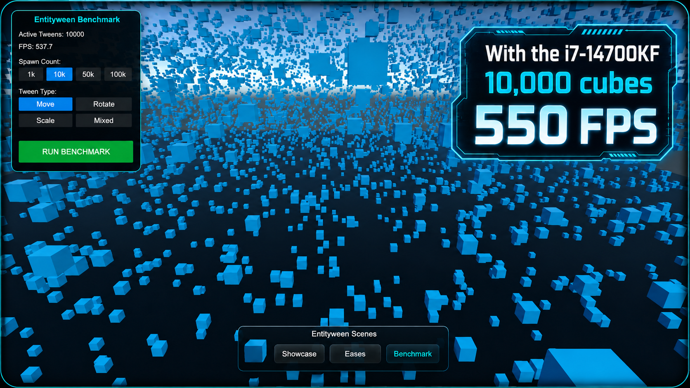

# Entityween

[](https://unity.com/)
[](https://unity.com/dots)
[](https://docs.unity3d.com/Packages/com.unity.burst@latest)
[](LICENSE)

<p align="center">
  
</p>

A Burst-compatible, allocation-free tweening package for Unity DOTS (`com.unity.entities`). It provides a fluent builder
API that compiles down to Burst-optimized runtime systems.

<p align="center">
  
  
</p>


## Features

- **Burst-Compiled**: Tween calculations and damp/chase systems are fully jobified and Burst-compiled.
- **Zero Allocations**: No runtime heap allocations during tween updates.
- **Play Anywhere**: Run safely inside parallel jobs, standard systems, or bakers.

---

## Installation

### Via Package Manager (Git URL)

Add package from git URL:

```text
https://github.com/xOrfe/Entityween.git
```

### Via `manifest.json`

Add this to your project's `Packages/manifest.json`:

```json
"com.xorfe.entityween": "https://github.com/xOrfe/Entityween.git"
```

---

## Start Modes

### Implicit (Destination-Only)

Reads the current transform component automatically when the tween starts:

```csharp
entity
    .ScaleTo(new float3(2f, 2f, 2f), 1.0f)
    .Ease(EaseType.OutBounce)
    .Play(ecb);
```

### Explicit Start

Forces the starting value, bypassing the current state:

```csharp
entity
    .ScaleTo(1.0f, float3.zero) // Duration, Start
    .To(new float3(1f, 1f, 1f)) // Destination
    .Ease(EaseType.OutCubic)
    .Play(ecb);
```

---

## Common Tweens & Chases

### Transform Tweens

| Method | Space | Affected Component |
|:---|:---|:---|
| `MoveToLocal(time, start)` / `(dest, time)` | Local | `LocalTransform.Position` (`float3`) |
| `MoveToWorld(time, start)` / `(dest, time)` | World | `LocalTransform.Position` (`float3`) |
| `RotateToLocal(time, start)` / `(dest, time)` | Local | `LocalTransform.Rotation` (`quaternion`) |
| `RotateToWorld(time, start)` / `(dest, time)` | World | `LocalTransform.Rotation` (`quaternion`) |
| `ScaleTo(time, start)` / `(dest, time)` | Local | `LocalTransform.Scale` (`float3` input, uniform DOTS scale at runtime) |
| `ScaleToUniform(time, start)` | Local | `LocalTransform.Scale` (`float`) |

### Non-Transform Value Tweens

To animate raw float, vector, or quaternion variables (ideal for shaders, custom math, or UI):

| Method | Value Type | Affected Component |
|:---|:---|:---|
| `FloatTo(time, start)` | `float` | `TweenValue<float>` |
| `Float2To(time, start)` | `float2` | `TweenValue<float2>` |
| `Float3To(time, start)` | `float3` | `TweenValue<float3>` |
| `QuaternionTo(time, start)` | `quaternion` | `TweenValue<quaternion>` |

### Target Chasing & Look-At

To continuously track or look at a target (another `Entity` or dynamic values):

| Method | Target Type | Easing/Damp Mode | Affected Component |
|:---|:---|:---|:---|
| `ChasePosition(target)` | `Entity` or `float3` | SmoothDamp / SmoothStep / Snap | `LocalTransform.Position` (`float3`) |
| `ChaseRotation(target)` | `Entity` or `quaternion` | SmoothDamp / SmoothStep / Snap | `LocalTransform.Rotation` (`quaternion`) |
| `Look(target)` | `Entity` or `float3` | SmoothDamp / SmoothStep / Snap | `LocalTransform.Rotation` (`quaternion`) |
| `ChasePositionAndRotation(target)` | `Entity` or `float4x4` | SmoothDamp / SmoothStep / Snap | `LocalTransform.Position` (`float3`) & `Rotation` (`quaternion`) |
| `ChasePositionAndLook(target)` | `Entity` or `float4x4` | SmoothDamp / SmoothStep / Snap | `LocalTransform.Position` (`float3`) & `Rotation` (`quaternion`) |

### Configuration Modifiers

Apply these builder methods before playing a tween or chase to customize behavior:

* **Eases & Loops**:
  * `.Ease(EaseType)`: Easing function (e.g. `EaseType.InOutQuad`).
  * `.Loop(LoopType, count)`: Loop playback (`Repeat`, `PingPong`). Count `0` is infinite. `Random` currently falls back to `Repeat`.
  * `.TimeType(PlaybackTimeType)`: Time source (`Scaled`, `Unscaled`, `Fixed`).
* **Start/End Control**:
  * `.To(destination)` / `.Destination(destination)`: Explicitly sets the target end value.
  * `.From(start)`: Explicitly sets the start value (skips reading current state).
  * `.FromCurrent()`: Explicitly start tweening from the entity's current runtime value.
* **Path & Gizmos**:
  * `.Along(points, splineType, isClosed)`: Moves along a spline path.
  * `.Visualize()`: Renders the spline path gizmo in the editor Scene View.
* **Chasing Options**:
  * `.SmoothDamp(smoothTime, maxSpeed)`: Uses a velocity-damped spring (default for chase).
  * `.Ease(EaseType)`: Uses SmoothStep easing for target tracking.
  * `.Override()` / `.Override(true)`: Instantly snaps to the target.
  * `.Chase(smoothTime, mode, maxSpeed, killOnChase)`: Appends settling chase behavior directly to a standard destination tween.

---

## Loops & Time Types

```csharp
entity
    .MoveToWorld(new float3(0f, 10f, 0f), 2.0f)
    .Loop(LoopType.PingPong, count: 4) // Count 0 for infinite
    .TimeType(PlaybackTimeType.Unscaled)
    .Play(ecb);
```

* **LoopType**: `Repeat`, `PingPong` (`Random` currently falls back to `Repeat`)
* **PlaybackTimeType**: `Scaled` (standard delta time), `Unscaled` (realtime), `Fixed` (fixed update)

---

## Spline Paths


```csharp
// Path points collection
var points = new float3[]
{
    new float3(0f, 0f, 0f),
    new float3(2f, 5f, 0f),
    new float3(5f, 5f, 0f),
    new float3(7f, 0f, 0f)
};
float3[] tangents = null;
SplineUtility.InitializeOrResizeTangents(SplineType.CatmullRom, false, points, ref tangents);
var flatPoints = SplineUtility.GetFlatPointsArray<float3, Float3Math>(SplineType.CatmullRom, false, points, tangents);

entity
    .MoveToWorld(3.0f, startPosition)
    .Along(flatPoints, SplineType.CatmullRom, isClosed: false)
    .Ease(EaseType.InOutQuad)
    .Visualize() // Draws path gizmos in Scene View (Editor only)
    .Play(ecb);
```

Supported SplineTypes: `Linear`, `Step`, `CubicBezier`, `CatmullRom`, `BSpline`.

---

## Sequences

Choreograph multiple tweens, waits, and callback events:

```csharp
Sequence.Create()
    .Append(entity.MoveToWorld(new float3(0f, 5f, 0f), 0.5f).Ease(EaseType.OutQuad))
    .Append(entity.Wait(0.2f))
    .Join(entity.ScaleTo(new float3(1.5f), 0.3f)) // Play alongside next tween
    .Append(entity.MoveToWorld(new float3(5f, 5f, 0f), 0.5f))
    .AppendCallback("Done")
    .Play(ecb);
```

### Catching Callback Events

When a sequence reaches a callback node, it emits a temporary entity with a `SequenceCallbackEvent` component. Catch it
in a system and destroy the event:
```csharp
[BurstCompile]
public partial struct CallbackSystem : ISystem
{
    [BurstCompile]
    public void OnUpdate(ref SystemState state)
    {
        var ecb = new EntityCommandBuffer(Allocator.Temp);

        foreach (var (cb, eventEntity) in SystemAPI.Query<RefRO<SequenceCallbackEvent>>()
                     .WithEntityAccess())
        {
            if (cb.ValueRO.CallbackId == "Done")
            {
                // Trigger your custom logic here
            }
            ecb.DestroyEntity(eventEntity); // Always clean up the event entity
        }

        ecb.Playback(state.EntityManager);
        ecb.Dispose();
    }
}
```

---

## Playback Contexts

You can execute a built tween/sequence in different environments:

### @Entity Command Buffer (Systems/Jobs)

```csharp
tween.Play(ecb);
```

### @Parallel Jobs (Requires Sort Key)

```csharp
tween.Play(chunkIndex, ref parallelWriter);
```

### @Immediate Execution (Main Thread)

```csharp
tween.Play(state.EntityManager);
```

### @Baker (Subscenes)

```csharp
public class ObstacleBaker : Baker<ObstacleAuthoring>
{
    public override void Bake(ObstacleAuthoring authoring)
    {
        var entity = GetEntity(TransformUsageFlags.Dynamic);
        entity
            .MoveToLocal(new float3(0f, 1f, 0f), 2.0f)
            .Loop(LoopType.PingPong)
            .Ease(EaseType.InOutSine)
            .Play(this);
    }
}
```

---

## Curve & Spline Utilities

Located in the `XO.Curve` namespace, these math and spline helper utilities are fully Burst-compatible and can be used on the main thread or inside jobs.

### SplineUtility

`SplineUtility` provides helpers to compute, resize, and prepare spline points/tangents before playing a tween:

| Method | Description |
|:---|:---|
| `GetTargetTangentLength(splineType, isClosed, pointCount)` | Computes the required tangent array size for a given spline configuration. |
| `InitializeOrResizeTangents<T>(splineType, isClosed, points, ref tangents, autoCalculate)` | Initializes/resizes a tangent array and optionally computes default tangents. |
| `RecalculateAllTangents<T>(splineType, isClosed, points, tangents)` | Recomputes all control/boundary tangents for the spline points. |
| `CalculateDefaultTangents<T>(splineType, isClosed, points, tangents, index)` | Computes a default tangent at a single index `i`. |
| `GetFlatPointsArray<T, TMath>(splineType, isClosed, points, tangents, mathProvider)` | Merges spline points and tangents into a flat array compatible with the tween runtime. |

### Curve Evaluation & Math Providers

To evaluate curves, calculate distances, or run custom spring-damping calculations:

* **Math Providers (`ICurveMath<T>`)**:
  * Obtain via `CurveMathUtility.GetMathProvider<T>()`.
  * Implementations: `FloatMath`, `Float2Math`, `Float3Math`, `QuaternionMath`.
* **Common Math Operations**:
  * `Lerp(a, b, t)`: Linearly interpolates two values (performs spherical linear interpolation `slerp` for quaternions).
  * `EvaluateSpline(type, p0, p1, p2, p3, t)`: Evaluates a spline segment at local time `t` (supports `Linear`, `Step`, `CubicBezier`, `CatmullRom`, `BSpline`).
  * `GetDistance(a, b)`: Calculates distance between two values (angular distance for quaternions).
  * `SmoothDamp(current, target, ref velocity, smoothTime, maxSpeed, deltaTime)`: Smoothly damps towards a target value.

### Tangent Generation Example

Generate control tangents for spline keypoints automatically at runtime:

```csharp
using XO.Curve;
using Unity.Collections;
using Unity.Mathematics;

// 1. Spline keypoints
float3[] points = new float3[] 
{ 
    new float3(0f, 0f, 0f), 
    new float3(2f, 5f, 0f), 
    new float3(5f, 0f, 0f) 
};
float3[] tangents = null;

// 2. Auto-calculate the required boundary/control tangents
SplineUtility.InitializeOrResizeTangents(
    SplineType.CatmullRom, 
    isClosed: false, 
    points, 
    ref tangents, 
    autoCalculate: true
);

// 3. Flatten keypoints & tangents into a single array ready for Along()
float3[] flatPoints = SplineUtility.GetFlatPointsArray<float3, Float3Math>(
    SplineType.CatmullRom, 
    isClosed: false, 
    points, 
    tangents
);
```

---

<p align="center">
  
</p>

---

## License

MIT. See [LICENSE](LICENSE) for details.
